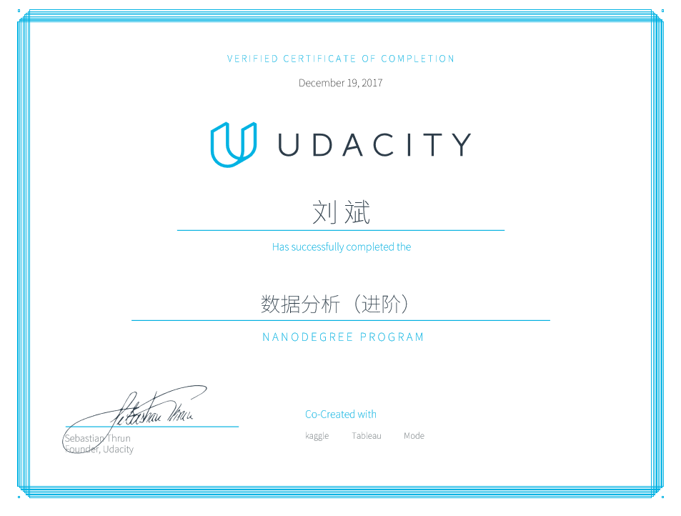

# [Udacity Data Analyst (Advanced) Nanodegree](https://www.udacity.com/course/data-analyst-nanodegree--nd002)
Projects for my Udacity Data Analyst Nanodegree

### P3: Wrangle OpenStreetMap Data

Choose any area of the world in https://www.openstreetmap.org and use data munging techniques, such as assessing the quality of the data for validity, accuracy, completeness, consistency and uniformity, to clean the OpenStreetMap data for a part of the world that you care about. Choose to learn SQL or MongoDB and apply your chosen schema to the project.

[Link to report](/p3/report.md)

[Link to review](https://review.udacity.com/#!/reviews/607181)

### P4: Explore and Summarize Data

Use R and apply exploratory data analysis techniques to explore a selected data set for distributions, outliers, and anomalies.

[Link to report](/p4/report.pdf)

[Link to review](https://review.udacity.com/#!/reviews/695248)

### P5: Identify Fraud from Enron Email

Building an algorithm with machine learning skills to identify Enron Employees who may have committed fraud based on the public Enron financial and email dataset.

[Link to report](/p5/README.md)

[Link to review](https://review.udacity.com/#!/reviews/798679)

### P6: Make Effective Data Visualization

Create a data visualization from a data set that tells a story or highlights trends or patterns in the data. Use either dimple.js or d3.js to create the visualization. Your work should be a reflection of the theory and practice of data visualization, such as visual encodings, design principles, and effective communication.

[Link to report](/p6/README.md)

[Link to review](https://review.udacity.com/#!/reviews/916570)

